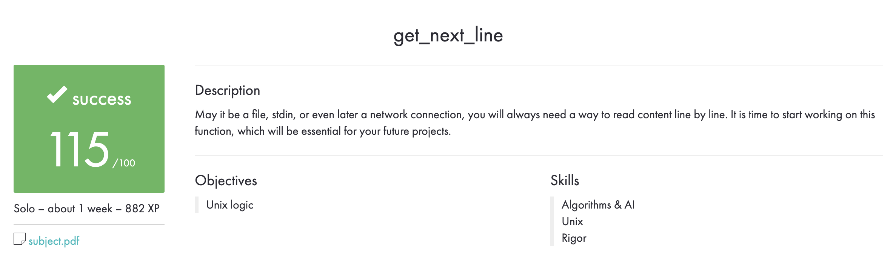

# get_next_line

## Description

A function that allows you to read content line by line from standard input or from a file.

In this project, we use some functions from [my libft library](https://github.com/VitMarKha/libft), as well as some functions we modify.

The compilation was with flags: ``gcc -Wall -Wextra -Werror``.

All files pass to ``Norminette``.

No memory leaks.

## Using

Write a prototype of the ``int get_next_line(int fd, char **line)`` function in your project. In your ``h`` file, write what ``BUFFER_SIZE`` will be equal to so that you do not have to write its value on the command line when compiling.

## my_test

Moving ``main.c`` and ``text.txt`` to the folder with ``get_next_line``, then compile ``gcc -Wall -Wextra -Werror -D BUFFER_SIZE=32 get_next_line.c get_next_line_utils.c main.c``. Run ``a.out``, we can also check for leaks using the command ``leaks a.out``.

## Evaluation

